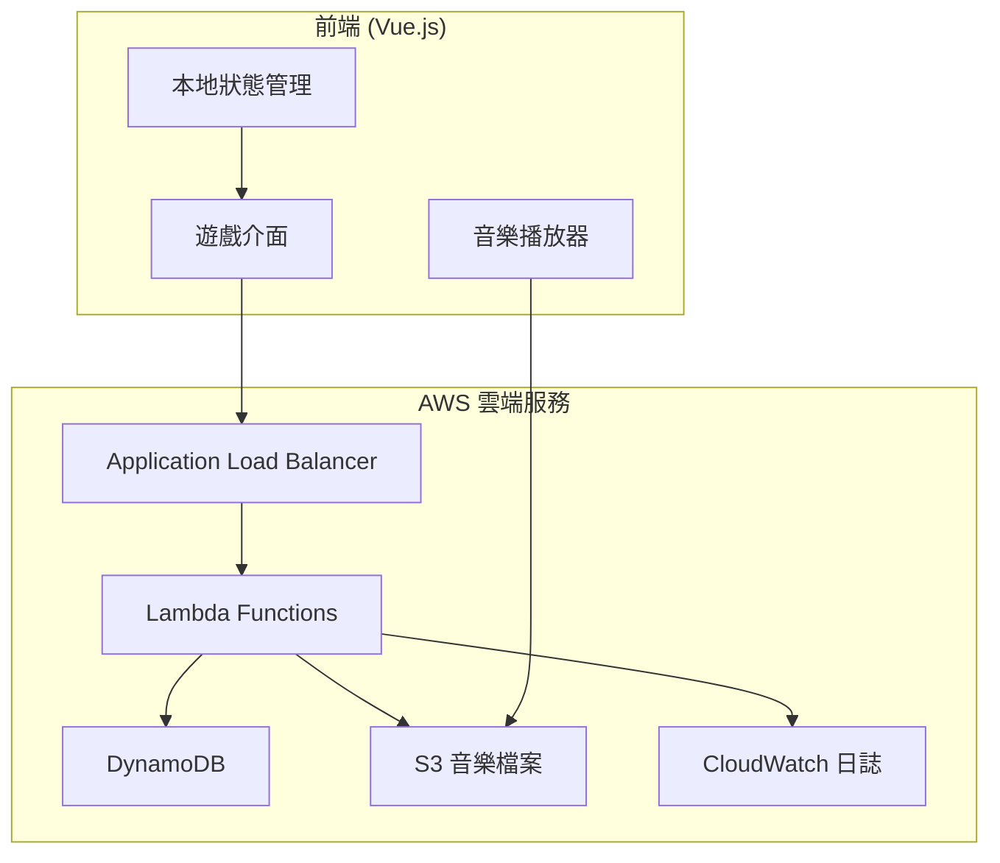
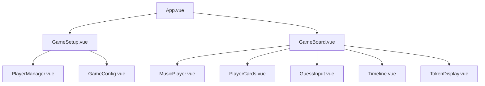
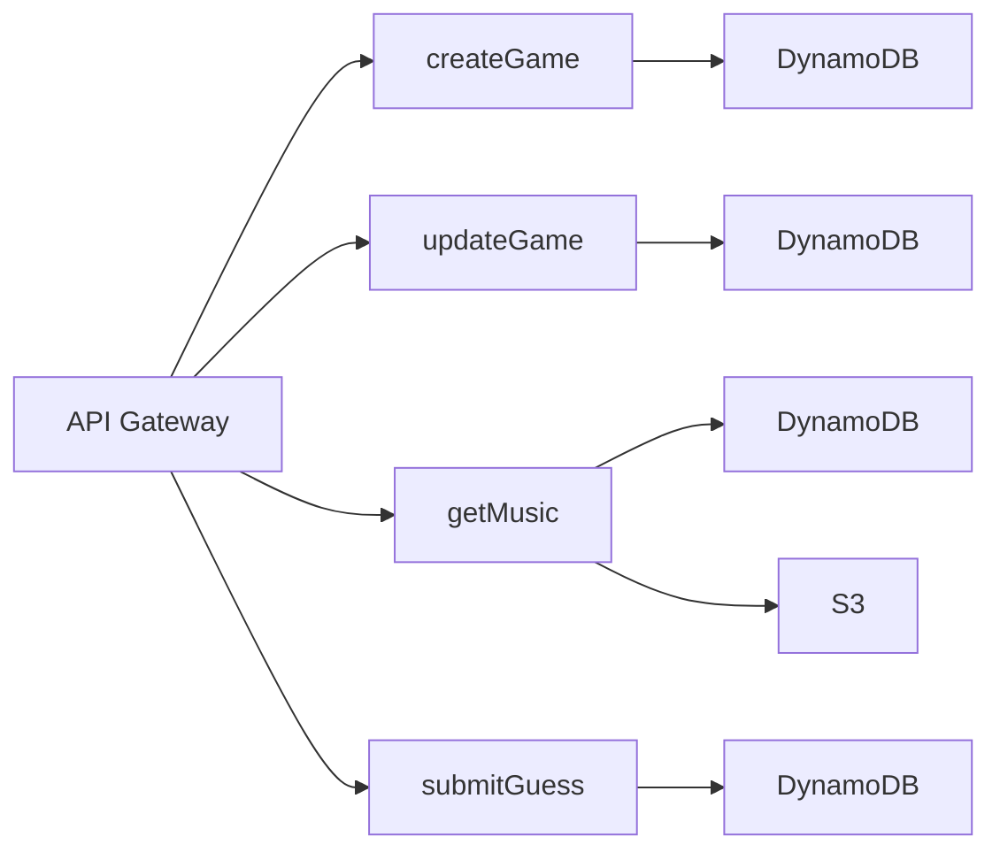

# 設計文件

## 概述

金曲猜歌王是一個基於 Hitster 桌遊的 Web 應用程式，採用無伺服器架構部署在 AWS 上。系統支援多個獨立的遊戲房間，每個房間內的玩家聚在同一台電腦前進行本地多人遊戲。

### 核心遊戲流程
1. 主持人創建房間並配置遊戲規則（獲勝卡牌數、玩家數量、歌曲標籤）
2. 輪流播放音樂片段，玩家猜測歌曲名稱
3. 猜對歌名的玩家進入年份猜測階段
4. 正確猜測年份後獲得卡牌，需要按時間順序插入個人時間線
5. 首位達到設定卡牌數量的玩家獲勝

## 架構

### 系統架構圖



### 技術棧
- **前端**: Vue.js 3 + Composition API
- **後端**: AWS Lambda (Node.js)
- **資料庫**: DynamoDB
- **檔案儲存**: S3 (音樂檔案)
- **監控**: CloudWatch
- **部署**: Serverless Framework

## 元件和介面

### 前端元件架構



#### 主要元件說明

**GameSetup.vue**
- 遊戲房間創建和配置
- 玩家名稱輸入和管理
- 遊戲規則設定（獲勝卡牌數、歌曲標籤選擇）

**GameBoard.vue**
- 主要遊戲介面
- 協調各子元件的互動
- 管理遊戲狀態和輪次

**MusicPlayer.vue**
- 音樂播放控制
- 顯示播放進度
- 支援代幣功能（延長播放時間、年份提示）

**Timeline.vue**
- 顯示玩家的卡牌時間線
- 支援拖拽插入新卡牌
- 視覺化年份排序

### 後端 API 設計

#### Lambda 函數架構



#### API 端點

**POST /api/games**
```json
{
  "maxPlayers": 4,
  "winningCards": 5,
  "musicTags": ["80s", "pop"]
}
```
回應: `{ "gameId": "game-123", "roomCode": "ABCD" }`

**POST /api/games/{gameId}/players**
```json
{
  "playerName": "玩家1"
}
```

**GET /api/games/{gameId}/music**
- 根據遊戲配置的標籤過濾音樂
- 回傳音樂 URL 和基本資訊（不含答案）

**POST /api/games/{gameId}/guess**
```json
{
  "playerId": "player-1",
  "guessType": "song|year",
  "guess": "歌曲名稱 或 1985"
}
```

**GET /api/games/{gameId}/state**
- 回傳完整遊戲狀態

## 資料模型

### DynamoDB 表格設計

#### Games 表格
```json
{
  "PK": "GAME#game-123",
  "SK": "METADATA",
  "gameId": "game-123",
  "roomCode": "ABCD",
  "status": "playing|finished|waiting",
  "config": {
    "maxPlayers": 4,
    "winningCards": 5,
    "musicTags": ["80s", "pop"]
  },
  "currentRound": {
    "currentPlayer": "player-1",
    "musicId": "music-456",
    "phase": "song_guess|year_guess|card_placement",
    "usedMusicIds": ["music-123", "music-456"]
  },
  "players": [
    {
      "id": "player-1",
      "name": "玩家1",
      "tokens": 2,
      "cards": [
        {
          "musicId": "music-123",
          "title": "歌曲名稱",
          "year": 1985,
          "position": 0
        }
      ]
    }
  ],
  "createdAt": "2026-03-14T10:00:00Z",
  "updatedAt": "2026-03-14T10:30:00Z",
  "ttl": 1647259200
}
```

#### Music 表格
```json
{
  "PK": "MUSIC#music-123",
  "SK": "METADATA",
  "musicId": "music-123",
  "title": "歌曲名稱",
  "artist": "歌手名稱",
  "year": 1985,
  "s3Key": "music/song-123.mp3",
  "previewStart": 30,
  "previewDuration": 15,
  "tags": ["80s", "pop", "chinese"],
  "difficulty": "easy|medium|hard"
}
```

#### GSI 設計
- **TagIndex**: `tag` (PK) + `year` (SK) - 用於按標籤和年份查詢音樂
- **GameStatusIndex**: `status` (PK) + `updatedAt` (SK) - 用於清理過期遊戲

## 錯誤處理

### 前端錯誤處理
1. **網路連線錯誤**: 顯示重試按鈕，自動重新連線
2. **音樂載入失敗**: 自動跳過該首歌曲，記錄錯誤
3. **遊戲狀態不同步**: 重新載入遊戲狀態
4. **無效輸入**: 即時驗證並顯示錯誤訊息

### 後端錯誤處理
1. **DynamoDB 錯誤**: 重試機制，記錄到 CloudWatch
2. **S3 檔案不存在**: 回傳替代音樂檔案
3. **並發更新衝突**: 使用條件更新和重試邏輯
4. **Lambda 超時**: 設定適當的超時時間和錯誤回應

### 錯誤碼定義
```javascript
const ErrorCodes = {
  GAME_NOT_FOUND: 'GAME_001',
  PLAYER_LIMIT_EXCEEDED: 'GAME_002',
  INVALID_GAME_STATE: 'GAME_003',
  MUSIC_NOT_AVAILABLE: 'MUSIC_001',
  GUESS_TIMEOUT: 'GUESS_001'
}
```

## 測試策略

### 單元測試
- **前端**: Vue Test Utils + Jest
  - 元件渲染測試
  - 使用者互動測試
  - 狀態管理測試

- **後端**: Jest + AWS SDK Mock
  - Lambda 函數邏輯測試
  - DynamoDB 操作測試
  - 錯誤處理測試

### 整合測試
- API 端點測試
- 資料庫操作測試
- S3 檔案存取測試

### 端對端測試
- 完整遊戲流程測試
- 多玩家互動測試
- 錯誤恢復測試

### 效能測試
- Lambda 冷啟動時間
- DynamoDB 讀寫效能
- 音樂檔案載入速度
- 並發遊戲房間測試

## 安全性考量

### 資料驗證
- 所有使用者輸入進行伺服器端驗證
- 防止 SQL 注入和 XSS 攻擊
- 限制請求頻率和大小

### 存取控制
- 遊戲房間隔離（玩家只能存取自己的房間）
- S3 音樂檔案使用預簽名 URL
- API Gateway 限流和認證

### 資料保護
- 敏感資料加密儲存
- 遊戲資料自動過期清理
- CloudWatch 日誌不記錄敏感資訊

## 效能最佳化

### 前端最佳化
- Vue.js 元件懶載入
- 音樂檔案預載入和快取
- 圖片和靜態資源 CDN
- 狀態更新防抖動

### 後端最佳化
- Lambda 函數預熱
- DynamoDB 讀寫容量自動擴展
- S3 音樂檔案 CloudFront 分發
- 資料庫查詢最佳化

### 快取策略
- 音樂資料庫快取在 Lambda 記憶體
- 遊戲狀態適度快取
- 靜態資源瀏覽器快取

## 監控和日誌

### CloudWatch 指標
- Lambda 函數執行時間和錯誤率
- DynamoDB 讀寫容量使用率
- API Gateway 請求數和延遲
- 遊戲房間活躍數量

### 自定義指標
- 遊戲完成率
- 平均遊戲時長
- 音樂播放成功率
- 使用者猜測準確率

### 告警設定
- Lambda 函數錯誤率過高
- DynamoDB 容量不足
- S3 檔案存取失敗
- 系統整體可用性下降